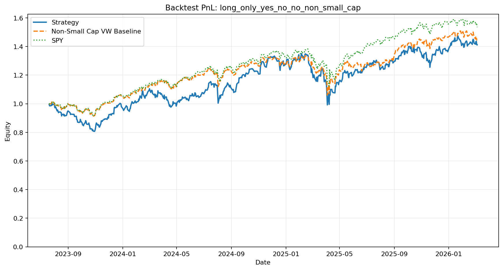
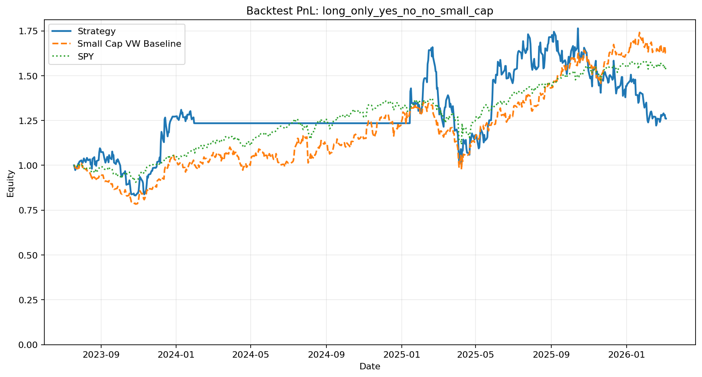

# An Implementation of LLM-Based News Signal Quant Strategies Using Affordable Data

## Introduction

Recent papers such as [Expected Returns and Large Language Models](https://papers.ssrn.com/sol3/papers.cfm?abstract_id=4416687) and [Can ChatGPT Forecast Stock Price Movements? Return Predictability and Large Language Models](https://papers.ssrn.com/sol3/papers.cfm?abstract_id=4412788) report very high Sharpe ratios from using LLMs to process news for cross-sectional stock selection. Those results attracted a lot of attention, but for individual researchers it is not easy to obtain the kind of professional news datasets often used in academic or institutional work.

This repo implements a similar news-signal workflow using EODHD news and OHLCV data instead. The data used for the experiments in this repo cost about `$25` in total, so the goal here is not to exactly reproduce the papers, but to test how far a retail-accessible data source can go when you apply comparable ideas.

## What This Repo Tests

This repo studies NYSE and NASDAQ common stocks covered by the available EODHD OHLCV and news data. In the experiments included under `outputs/`, the data pipeline uses both active and delisted names when available.

There are two main workflows:

1. `LLM Embedding Work Flow`: deduplicate raw news, embed each article, train a linear return-prediction head, and evaluate the resulting stock-day predictions.
2. `Direct LLM Response Workflow`: ask an instruction-following LLM to classify each article, aggregate article-level labels into stock-day signals, and backtest simple portfolio construction rules.

The direct-response workflow currently includes three core strategy families, each also tested with `small_cap` and `non_small_cap` variants when market-cap data is available:

1. `strict_yes_or_unknown_vs_no_or_unknown`: long stock-days with at least one `YES` and no `NO`; short stock-days with at least one `NO` and no `YES`; `UNKNOWN` can coexist on either side.
2. `paper_like_positive_negative`: a paper-style approximation that goes long when `yes_count > no_count` and short when `no_count > yes_count`.
3. `long_only_yes_no_no`: long-only, buying stock-days with at least one `YES` and no `NO`.

## Implementation Details And Assumptions

- Number of sigle ticker news used: 817,004 (from 01/01/2020 to 03/07/2026).
- News timestamps are parsed from the EODHD `date` field as UTC timestamps, assuming the date format is ISO8601.
- Every article is assigned to a trading day using a `09:00 America/New_York` cutoff, so the signal window is `(previous_trade_day_09:00_NY, current_trade_day_09:00_NY]`.
- Both the supervised training workflow and the backtests use `open_to_open` return as the target or realized return.
- In the OHLCV-based tradability filter, a stock-day is eligible only if the stock has a valid opening price for that trading day, its previous day's closing price is at least `$1`, and its average daily dollar trading volume over the prior `20` trading days is at least `$1,000,000`.
- The implementation only uses information available at entry time for filtering. If a stock later has no next-trading-day open price, its realized open-to-open return is set to `0`.
- Raw EODHD news is deduplicated with `deduplicate_news_bow.py`, using `min_text_chars=100`, `cosine_threshold=0.8`, and a `5` business-day window.
- In the embedding workflow, the repo supports three ways to train the linear prediction layer: using the average embedding of all articles for a stock-day, treating each article separately during training, or learning an article-level scoring function and then summing those article scores to get the stock-day prediction.
- The grid search in `outputs/grid_search_linear_modes_v2` trains on `2020-01-01` to `2023-07-17` and evaluates out of sample from `2023-07-19` onward. This split is chosen because `2023-07-18` is the release date of Llama 2, so the validation window starts after that release.
- In the direct-response workflow, `--promptV2` uses a stricter next-trading-day classification prompt, asking for `LONG`, `SHORT`, or `INSUFFICIENT_INFORMATION`, then mapping those outputs back to stored labels `YES`, `NO`, and `UNKNOWN`.
- Article-level responses are aggregated to stock-day counts: `yes_count`, `no_count`, `unknown_count`, `news_count`, and `title_only_count`.
- Daily trading is skipped when the eligible stock-day pool is too small. The included backtests use `min_news_pool=10`.
- For short-enabled variants, the included backtests also require at least `min_short_count=1`; otherwise the strategy stays in cash for that date.
- Transaction cost is modeled as `3` bps in the included backtests.
- When `market_cap_dir` is supplied, size buckets are defined every day using prior-day market cap and the NYSE `20`th-percentile breakpoint.
- Tickers with missing market-cap history are excluded from `small_cap` and `non_small_cap` variants, as well as from the corresponding value-weighted size baselines.
- The included PnL plots compare strategies either against `SPY` or against cached value-weighted small-cap and non-small-cap baselines, depending on the variant.

## Main Results

1. The embedding-based workflow does not show robust out-of-sample performance in the included experiments. In `outputs/grid_search_linear_modes_v2`, the `mean` and `sum_head` linear modes have clearly better training IC than validation IC, and their validation rank IC is generally near zero or negative. The `article` mode is more stable, but still weak out of sample. Overall, the linear-head workflow looks fragile and overfit-prone on this dataset.
2. In the direct-response workflow, the most promising-looking variant before fixing the news timestamp issue was `outputs/llm_response_backtest_promptv2_tok3/strict_yes_or_unknown_vs_no_or_unknown_non_small_cap`. However, after correcting the timestamp problem in the news dataset and rerunning the backtest, the stronger-looking effect largely disappears, and the corrected run in `outputs/llm_response_backtest_promptv2_tok3_correct_news_time/long_only_yes_no_no_non_small_cap` no longer beats the `SPY` benchmark in the included plot.



3. Although `Can ChatGPT Forecast Stock Price Movements?` reports stronger Sharpe in small-cap stocks, EODHD's small-cap news coverage appears too thin for that result to carry over cleanly here. In several `*_small_cap` runs there are periods with fewer than `10` investable names after filtering, so the strategy does not trade and the PnL curve stays flat for long stretches.



## Conclusion

The main takeaway from this repo is that news-based cross-sectional trading is extremely sensitive to the data source. Quality (especially correctness of news publication time) and completeness of the underlying news matters.

## Quick Start

### LLM Embedding Work Flow

1. Get stock universe

```
python fetch_eodhd_exchange_universe.py \
  --token-file "./EODHD_token" \
  --exchange US \
  --security-type common_stock \
  --include-delisted \
  --output-dir "./us_universe"
```

2. Get OHLCV

```
python3 fetch_eodhd_ohlcv_by_ticker.py \
  --token-file "./EODHD_token" \
  --tickers-file "./us_universe/us_common_stock.tickers.txt" \
  --allowed-exchange NYSE \
  --allowed-exchange NASDAQ \
  --output-dir "your_ohlcv_dir" \
  --start-date 2020-01-01 \
  --timeout 60 \
  --retry-attempts 8 \
  --retry-backoff-seconds 2
```

3. Download news data

```
python fetch_eodhd_single_symbol_news.py \
  --token-file "./EODHD_token" \
  --tickers-file "./us_universe/us_common_stock.tickers.txt" \
  --allowed-exchange NYSE \
  --allowed-exchange NASDAQ \
  --output-dir "your_news_data_dir" \
  --start-date 2020-01-01 \
  --max-requests-per-minute 199 \
  --timeout 60 \
  --retry-attempts 8 \
  --retry-backoff-seconds 2
```

4. Deduplicate raw news

```
python deduplicate_news_bow.py \
  --input-dir "your_news_data_dir" \
  --output-dir "your_news_data_dir_dedup" \
  --min-text-chars 100 \
  --cosine-threshold 0.8 \
  --window-business-days 5 \
  --max-records-per-file 2048
```

5. Embed deduplicated news

```
python generate_news_embeddings.py \
  --input-dir "your_news_data_dir_dedup" \
  --output-dir "your_news_embedding_dir" \
  --device cuda \
  --model-name-or-path "meta-llama/Llama-2-13b-hf" \
  --start-date "2020-01-01T00:00:00Z" \
  --end-date "2100-01-01T00:00:00Z" \
  --max-length 2048 \
  --batch-size 16 \
  --rows-per-chunk 2048
```

6. Train return prediction heads

```
python train_news_return_heads.py \
  --news-emb-dir "your_news_embedding_dir" \
  --ohlcv-dir "your_ohlcv_dir" \
  --output-dir "your_model_dir" \
  --heads linear \
  --linear-train-mode mean \
  --linear-l2 1e-4 \
  --min-ic-universe 20 \
  --train-start 20200101 \
  --train-end 20211231 \
  --val-start 20220101 \
  --val-end 20220901
```

The default `val-end` is approximatly the end of Llama2's pretraining data coverage.
`--linear-train-mode` supports:
`mean`: fit `head(mean(embeddings))->r`,
`article`: fit `head(embedding)->same r` for every article in a stock-day,
`sum_head`: fit `sum(head(embedding))->r` with Adam.

7. Run backtest

```
python run_news_head_backtest.py \
  --news-emb-dir "your_news_embedding_dir" \
  --ohlcv-dir "your_ohlcv_dir" \
  --model-kind linear \
  --model-path your_model_dir/linear_head.pt \
  --output-dir "your_output_dir" \
  --start-date 20230719 \
  --end-date 20260306 \
  --long-short-quantile 0.2 \
  --min-price 1 \
  --min-adv-usd 1000000 \
  --cost-bps 3 \
  --min-news-pool 10
```

The default `start-date` is the day after Llama2's publication.  
Backtest execution assumptions: tradable stocks are filtered only using information known at entry time (`prev_close`, `ADV20(t-1)`, and same-day `open` availability). If a stock has no next-trading-day open price, its realized open-to-open return is set to `0`.

### Direct LLM Response Workflow

Instead of embedding news and fitting a supervised return head, you can directly ask an instruction-following LLM to classify whether a news is a good news, and then backtest simple trading rules on those responses.

0. Do 1-4 of the previous section

1. Generate LLM responses on deduplicated news after the Llama2 release date

```
python generate_news_llm_responses.py \
  --input-dir "your_news_data_dir_dedup" \
  --output-dir "your_llm_response_dir" \
  --device cuda \
  --model-name-or-path "meta-llama/Llama-2-13b-chat-hf" \
  --start-date "2023-07-19T00:00:00Z" \
  --end-date "2100-01-01T00:00:00Z" \
  --news-truncate-chars 1500 \
  --max-new-tokens 48 \
  --rows-per-chunk 2048
```

If you want the stricter next-trading-day classification prompt, add `--promptV2`. That mode asks the model to output `LONG`, `SHORT`, or `INSUFFICIENT_INFORMATION` first, then maps those responses back to the stored labels `YES`, `NO`, and `UNKNOWN` for downstream analysis/backtests.

`generate_news_embeddings.py` does not use this prompt switch; it embeds the cleaned raw news text directly.

This script:
- keeps the same resume and multi-GPU sharding behavior as `generate_news_embeddings.py`
- defaults to 8-bit loading on CUDA when supported, with automatic fp16 fallback
- stores `responses_*.parquet` with parsed labels, raw model responses, and an `is_title_only` flag

2. Run direct-response backtests

```
python run_llm_response_backtest.py \
  --response-dir "your_llm_response_dir" \
  --ohlcv-dir "your_ohlcv_dir" \
  --output-dir "your_llm_backtest_dir" \
  --baseline-ohlcv-path "./sp500_baseline_spy/parquet/US/SPY.US.parquet" \
  --market-cap-dir "/export/fs06/jyu197/eodhd/historical_market_cap_yf" \
  --start-date 20230719 \
  --end-date 20260306 \
  --min-price 1 \
  --min-adv-usd 1000000 \
  --cost-bps 3 \
  --min-news-pool 10 \
  --min-short-count 1
```

This script currently evaluates three strategies:
- `strict_yes_or_unknown_vs_no_or_unknown`: long stock-days with at least one `YES` and no `NO`; short stock-days with at least one `NO` and no `YES`; `UNKNOWN` may coexist on either side; weights are proportional to `yes_count` / `no_count` and normalized by gross signal strength
- `paper_like_positive_negative`: a paper-style approximation that goes long when `yes_count > no_count` and short when `no_count > yes_count`; weights are proportional to `paper_score = yes_count - no_count` and normalized by gross signal strength
- `long_only_yes_no_no`: long-only strategy that buys stock-days with at least one `YES` and no `NO`

`--min-short-count` only affects the two short-enabled strategies. If a date has fewer short candidates than this threshold, the strategy stays in cash for that date. Set `--min-short-count 0` if you want signal-strength weighting to allow fully long days when no short candidates exist.

If `--baseline-ohlcv-path` is provided, the PnL plots overlay a buy-and-hold baseline (for example `SPY.US`) and pin the Y-axis lower bound at `0`.

If `--market-cap-dir` is provided, the script also:
- constructs daily `small` / `non_small` buckets using prior-day market cap and the NYSE 20th-percentile breakpoint
- excludes tickers with missing market-cap history from the `small` / `non_small` universes
- runs extra size-filtered variants such as `paper_like_positive_negative_small_cap` and `paper_like_positive_negative_non_small_cap`
- builds and caches value-weighted `small_cap` / `non_small_cap` baseline daily series, then reuses them on later runs

The exported size artifacts are written under `your_llm_backtest_dir/baselines/`, including `response_size_membership.parquet`, `nyse_size_breakpoints.parquet`, `small_cap_baseline_daily.parquet`, and `non_small_cap_baseline_daily.parquet`.

The LLM-response backtest caches filtered OHLCV-derived `symbol_states`, daily size memberships, NYSE breakpoints, and size baselines under `.cache/run_llm_response_backtest/`, so repeated runs on the common `20230719+` window are much faster.